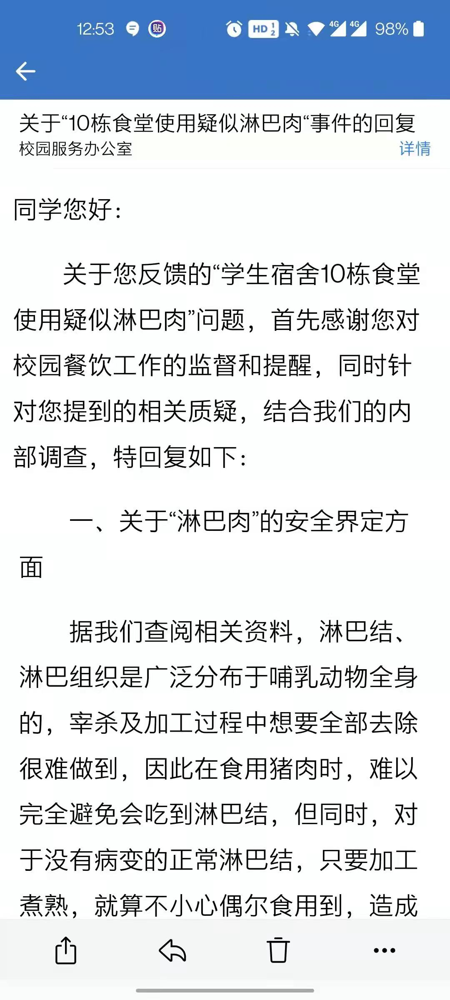
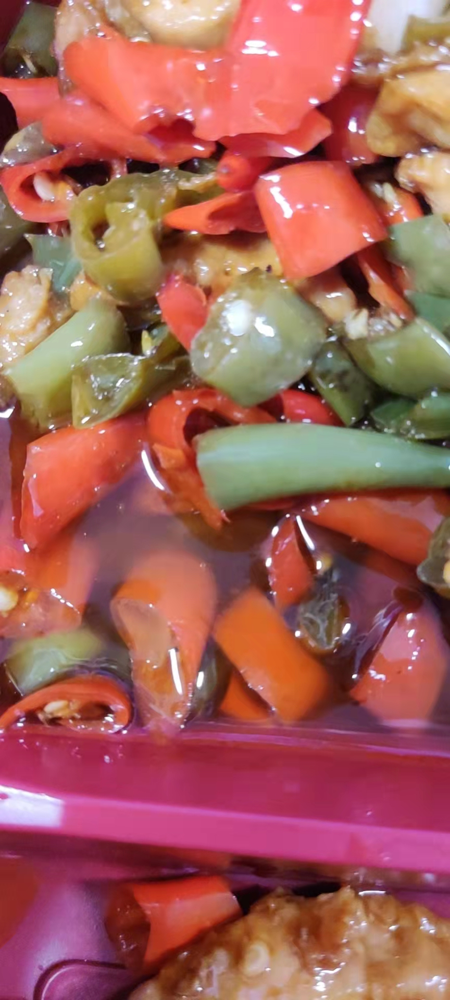
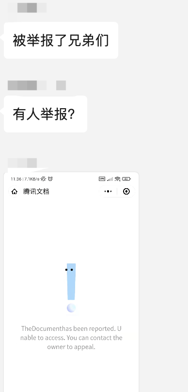

# 南方科技大学食堂问题与建议

## 当前存在的问题

1. 食堂卫生问题 （<u>下列问题并不是疫情之后才有的，请勿拿疫情当挡箭牌</u>）

    1. 菜品中频繁出现电池、钢丝球、头发丝、编织袋、包装纸、塑料片、竹签、石头、虫子等异物（图见附录）；

    2. 荔园餐厅出现老鼠（图见附录）
    
    3. 豆腐是酸的（反映给食堂经理，他表示这是正常的）
        https://www.bilibili.com/video/BV1Ju411Q79u?spm_id_from=333.1007.top_right_bar_window_history.content.click （这个可以放吗）
    
        鹌鹑蛋变质，发酸发臭，3月2日反馈后窗口表示鹌鹑蛋是当天的，食堂经理说鹌鹑蛋是2月18日的保质期为四个月。
    
        变质鹌鹑蛋

        
    
    4. 在食堂吃出问题时，解决方式是食堂补贴一顿饭的餐券（一般为20-30元），感觉惩罚力度不足，不足以让食堂在后续更加注意卫生问题。(根据《中华人民共和国食品安全法》规定生产不符合食品安全标准的食品或者销售明知是不符合食品安全标准的食品，消费者除要求赔偿损失外，还可以向生产者或者销售者要求支付价款十倍的赔偿金，不足1000元的按1000元算。)
    
    5. 很多同学表示十栋的饭菜经常导致拉肚子，去医院确诊为肠胃炎的也不在少数。（如果有医院的证明或者当天发的pyq也可以截图出来） 

    6. 早餐的馒头、包子有时会干硬、有异味，甚至遇到过轻微霉点，早餐卖剩下的食材会中午接着卖，且怀疑会反复冷冻隔天接着卖。深圳气温高，剩下的面食保存不好，很容易有异味。之前有同学建议食堂延长供餐时间（早餐九点结束太早，中午有课的同学12:10下课，然而12:30以后食堂的菜品就所剩无几），食堂给出的解释是时间久菜品会不新鲜，然而目前来看剩下的菜品反复售卖更不新鲜。

        早餐包子皮干硬，疑似反复冷冻后售卖：
        
        
        
        

2. 食堂质量及价格问题

    1. 大众菜的荤菜少且没有正常部位的肉，多为边角料或内脏，甚至出现淋巴肉；举例：辣子鸡只有鸡脚鸡脖子，红烧肉只有猪皮，回锅肉只有肥肉。（图见附录）
        对此食堂反馈淋巴肉对健康没有影响
    
       
    
       

    2. 其他档口的肉菜很贵：如中心食堂小炒，15、18、20元不等，只有几片肉；素菜窗口一小碗白萝卜/豆腐/冬瓜都要5块钱；小碟菜窗口一小碟（直径约12cm且放不满）鱼肉，鸡肉等从10元到15元不等，昂贵价格下份量少得可怜；九栋食堂肉菜价格为15、12、10元一份（上次学生10栋食堂价格太高，食堂解决方式是把10栋食堂跟9栋食堂饭菜进行调换）。
    
        青椒炒肉几乎没有肉：
    
        

    3. 食堂菜品质量下降明显，价格上升明显，尤其是大众窗口，比如荔园二楼小炒肉，以前是一份6元的猪肉，后来换成鸡肉（鸡架子，特指鸡脖子那些没肉的部分）不说，还涨到了10元; 炒白菜同样一份菜，一部分软的，一部分硬的，据此怀疑剩菜混着卖；番茄酱炒淀粉鸡块，当肉菜卖，3块鸡块卖5块，肯德基都没这么贵

    4. 学校9栋食堂价格没降低，反而降低肉的品质，以及菜量。牛肉全部没了，仅剩下鸡鸭肉以及猪肉(且量比较少)。原来没有用小盘子装菜，现在调整为用小盘子装菜后，菜量明显少了很多。12元15元只有几块肉。且从西餐套餐可以看出来，目前只有猪肉和鸡肉，以前有牛肉。

    5. 很多素菜太油腻，不好吃。

        菜品油太多：
    
        

    6. 以前本科餐厅一份牛肉拉面+一个大鸡腿 = 12.5元，南科大荔园二楼现在一份牛肉面就10元（或者12元忘记了），真的是挺贵的，深圳表示不背这个锅。本科西餐牛扒鸡扒管够，价格分别是25和15

    7. 中心餐厅从开业至今食材口感、份量(之前的卤鸡腿3块后来5块再后来直接不卖了换成一丢丢的小鸡腿)明显下降。之前使用的肉口感劲道，如今更像是冻肉，臊子肉。食堂花样少也就罢了，菜品质量下降，其中是否存在贪腐问题！

    8. 食材处理不当。举例：猪脚上还有很多毛，鸡腿不熟，鱼鳞刮不净。（图见附录）
    
    9. 中心食堂新增档口价格严重溢出，举例：下图为新开档口35元套餐实物图。
    

3. 食堂菜品长期不更换

    菜品品种少且固定，相比于其他高校品种过少，对于来自不同地方的同学较难适应，去年研会发文承诺会引进的食堂窗口，很大一部分至今仍未引进。例如在早餐的包子上，多以甜口为主，且早餐包子多冷且硬，让同学们怀疑其是否新鲜，价格上卤肉包价格与校外价格一致，均为2r，有听说校内食堂是有补贴的，不知是否属实。

4. 其他问题

    1. 学生多次反应，各渠道投诉，学校各种座谈会避重就轻，沆瀣一气，食堂有恃无恐，最终变成现在的这个样子。
    下图是学校的座谈会，大家反映的质量以及价格问题避而不谈
    
    学生尝试收集食堂问题，问卷多次被恶意举报
    1. ...
    2. ...

## 建议

1. 公开食堂所有菜品价格 ；学生食堂是否有补贴？若有补贴，为什么价格依然如此贵，但是食材质量却如此差  

2. 价格与质量得匹配一下，建议参考教工餐厅

3. 厨房安装实时监控公放（比如九栋食堂，监控不能隐藏在没人的拐角处）

4. 针对提到的荤菜没有正常部位的肉的问题，食堂采购鸡、肉等原材料需要给出可以让学生、学校监督的方式；并且需要有有效的惩罚措施

5. 开放学生使用教工餐厅的权限，并把教工餐厅的菜式推广到其他餐厅，确保学生也能吃到教职工同等质量和价格的饭菜，学生和教职工不应该有阶级上的差别，大家都是学校的一份子，理应得到同等的对待

6. 对每个食堂窗口定期邀请全校部分师生品鉴，对做的极差的进行整改，实行淘汰制度

7. 食堂质量之差，学生花了钱也难以下咽，导致大量的食物浪费；强烈建议提升食堂品质，有助于相应国家“光盘行动”号召

8. 将食堂承包出去，而不是由整个集团管理一整个食堂，大家只能到这个食堂吃，吃什么只能由他们说了算。很多高校的食堂是将窗口承包给不同的商家，可以提供有利的竞争。

9. 食堂菜品重复问题，中心食堂大众菜跟学生餐厅的大众菜，荔园一楼大众菜完全一致的口味。且占据食堂大部分空间，做的也不好吃。多为肉边角料。中心食堂一个窗口空间太大，能否调整窗口大小，引进更多的窗口。图片为隔壁哈工大深圳食堂。

10. 如果食堂无法整改至大家满意，也可以在校园巴士二号线加一站五号门，方便大家取外卖。

附：食堂卫生问题图片

1.异物问题

包装纸

塑料片

瓜子壳

电池

钢丝

竹签

不知名异物

饺子中有异物且没煮熟

虫子

蜗牛

2.老鼠

3.变质问题

变质虾

4.食材问题

带毛肉

生鸡腿

淋巴肉

水煮肉片里的肉

